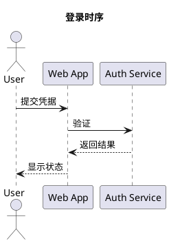

# PlantUML

创建或编辑 `.puml`、`.pu` 源文件时读取本参考。PlantUML 优先用于具有明确 UML 语义的图，尤其是复杂时序、类、组件、部署、状态和活动图。

## 文件边界



- 每张图使用匹配的 `@start...` 与 `@end...`，默认 UML 图使用 `@startuml` / `@enduml`。
- MindMap、WBS、Gantt、JSON、YAML 等专用图使用各自匹配的开始和结束指令。
- 参与者、类、组件等使用稳定别名，显示名称可以包含中文和空格。
- 一份源文件可以包含多张图，但默认拆分为一图一文件，除非用户需要统一管理。

## 建模规则

- 时序图按真实调用顺序书写，区分同步调用、异步消息和返回，不为美观篡改时序。
- 类图只保留与目标问题有关的属性、方法和关系；不要把完整代码结构机械搬入。
- 组件和部署图明确逻辑组件、运行节点及协议，不把部署节点与软件组件混为一层。
- 样式集中放在开头，保持少量 `skinparam` 或主题配置，不让视觉配置淹没模型。

## include 与安全

PlantUML 支持本地和远程 include。默认不使用 `!includeurl`，也不读取任务范围外的本地 include；只有用户明确提供并信任依赖时才使用。不要把私密内容提交到公共 PlantUML 服务。

## 完整验证

安装 PlantUML 后，如果本地版本支持新版 CLI，可对可信文件执行语法检查：

```bash
java -jar plantuml.jar --check-syntax diagram.puml
```

否则可直接输出 SVG，同时完成解析和视觉检查：

```bash
java -jar plantuml.jar --svg diagram.puml
```
